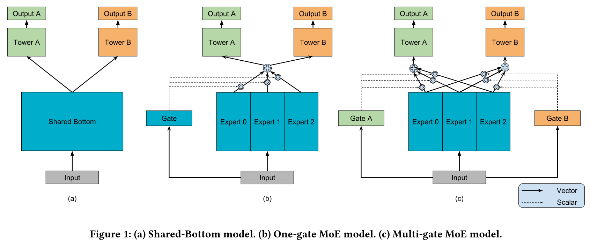
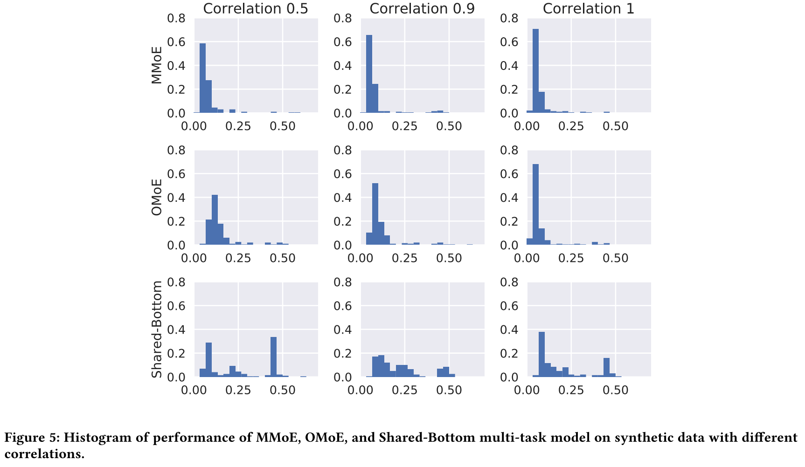

## Modeling Task Relationships in Multi-task Learning with Multi-gate Mixture-of-Experts

### 动机

现有的multi-task learning方法与task之间的相关性有关，当task之间的相关性低的时候，使用shared model甚至会比单独训练每个task效果更差。

### 方法

#### Shared-bottom Multi-task Model

$$
y_k=h^k(f(x))
$$

所有任务共享$f(x)$，使用不同的$h^k$来学习不同的下游任务。作者设计了一组实验，来说明Shared-bottom方法对于相关性低的任务效果不好。

#### Mixture-of-Experts

$$
y=\sum_{i=1}^ng(x)_if_i(x)
$$

MoE本身不是针对multi-task的，做法类似attention+ensemble，每个expert $f_i(x)$有一个可训练的权重$g(x)_i$。

#### Multi-gate Mixture-of-Experts

$$
y_k=h^k(f^k(x))\\
f^k(x)=\sum_{i=1}^ng^k(x)_if_i(x)\\
g^k(x)=\mathrm{softmax}(W_{gk}x)
$$

把multi-head attention的idea用到了multi-task上，每个task有一套自己的权重组合$g^k(x)$。这样做使得底层对于multi-task的参数共享更加灵活。然而多加了几个gate的参数量可以忽略不计。

### 实验

为了突出multi-gate的效果，作者将gate的数量设为1的MMoE称作OMoE进行对比。

#### Correlation对比

1. task之间correlation越高，3个方法的效果都越好。
2. MMoE对于不同correlation的数据效果差异不大，然而对于Shared-Bottom和OMoE来说，差异较大。correlation为1时，OMoE和MMoE效果相当。然而随着correlation降低，两者差距逐渐拉大，说明了multi-gate对于低correlation task的学习能力。
3. MoE比Shared-Bottom要好很多，说明了multi-expert是有用的。

#### Trainability

作者其实想要说明的是MMoE比较鲁棒，通过重复200次随机试验并用直方图表示MMoE效果好，方差低，Shared-Bottom效果差，方差高。作者提出了一个观点，Shared-Bottom在200次重复试验中也有几次达到了很低的loss，说明不适用multi-gate或是multi-expert也有机会学到multi-task的共通信息，只不过发生的概率很低，trainability差。

#### Census-income

2组multi-task试验：

* Task 1: Predict whether the income exceeds $50K; 

  Task 2: Predict whether this person’s marital status is never married. 

  Absolute Pearson correlation: 0.1768.

* Task 1: Predict whether the education level is at least college; 

  Task 2: Predict whether this person’s marital status is never married. 

  Absolute Pearson correlation: 0.2373.

Task 1作为主任务，task 2作为辅助任务，以主任务的AUC来调参。

对比MMoE，OMoE，Shared-Bottom，效果提升非常不显著，很尴尬，没有模拟数据试验中对比来的强烈。

#### Large-scale Content Recommendation

2个task：

(1) CTR

(2) 打分

##### 离线实验

两个task有一定的相关性，但是目标又不同，适合使用multi-task learning。文章提到目前google使用的就是Shared-Bottom来捕捉task之间的共同高阶特征。

从R2上看还是有一些差距，但是AUC提升不大。甚至OMoE居然不如Shared-Bottom，作者没有解释为什么。

此处感觉作者写错了，横轴应该是expert id。4个expert对2个task给的权重都不一样，尤其是expert 1，专注于satisfaction这个task。这个实验同时说明了multi-gate和multi-expert的有效性。

##### 线上实验

2个对比：

1. Shared-Bottom和Single-Task
2. MMoE和Shared-Bottom

有点看不懂这2个metric是什么东西，对比感觉不是很公平，Single-Task直接在Engagement上训练然后在satisfaction上测试，肯定比不过Shared-Bottom。

### Q&A

1. 文章亮点在哪里？

   模型novelty很低，无非就是一个multi-head attention的idea。然而作者对现有模型缺点进行了详细分析，并设计了相关实验来论证。实验做的比较充分，包含人工数据，公开数据集，和大规模业界推荐系统的离线在线实验，充分说明了模型的有效性（尽管模型很简单）。

2. 不同的expert之间没有正则，会不会导致学到一块儿去了？

   